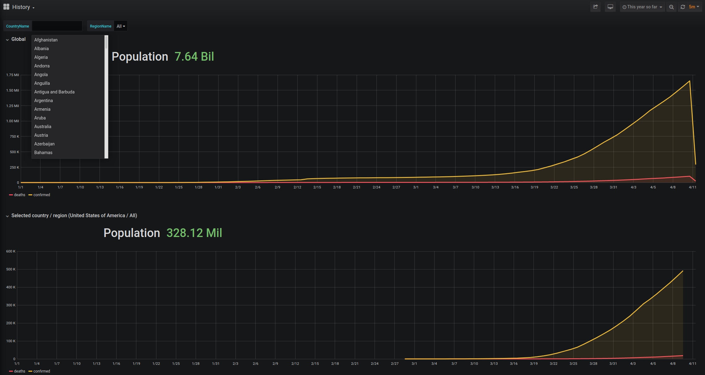

covid-arnold
============
COVID-19 lockdown tracker powered by "Arnold" Technology

Getting started
---------------

COVID-Arnold is built around docker-compose. To bring up a database, ingester, and Grafana instance to get going (requires Docker and `docker-compose`):

* Bring up the docker-compose stack: `make run`
* Watch the ingester load data (takes about 1 minute): `docker logs ingester`
* Access the Grafana dashboard: `http://localhost:3000/d/RiEKmsjWk/history`

Components
----------

Done:

* Postgres DB: stores statistics & predictions
* Ingester: downloads data and inserts into the DB
* Grafana: basic timeseries visualisations

Todo:

* Forecast: makes predictions based on the current datasets
* Uploader: uploads generated JSON datasets to an S3 bucket
* Frontend: visualise datasets from the S3 bucket

ScreenShots
-----------

